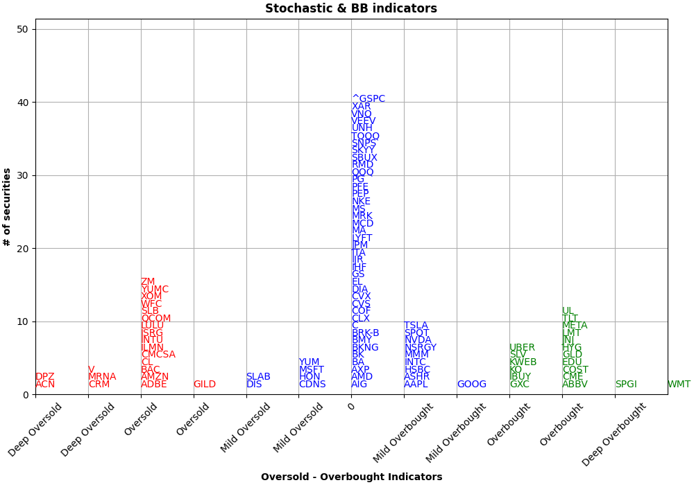

# 📈 Stock Oversold/Overbought Indicator Plot

This project helps you visualize stocks that are currently **oversold** or **overbought** based on technical indicators like **RSI** and **Stochastic**. It processes your watchlist from a CSV file and displays a color-coded histogram to highlight signal strength.



---

## 🚀 Features

- ✅ Automatically loads stock indicator values from `watchlist.csv`
- 🧹 Filters out unwanted tickers (e.g. index funds, certain ETFs)
- 📊 Visualizes strength signals in a histogram:
  - 🔴 **Red**: Deep Oversold (≤ -3)
  - 🟢 **Green**: Deep Overbought (≥ 3)
  - 🔵 **Blue**: Neutral / Mid-range

---

## 📂 Input File

**`watchlist.csv`** should include at least the following column:
- `symbol`

---

## 🛠️ How to Use

1. **Clone this repository**

   ```bash
   git clone https://github.com/nttssv/stock_check.git
   cd stock_check

2. **Place your watchlist.csv file (with stock symbols) in the project root folder**

3. **Install Dependencies**
	'''bash
	pip install -r requirements.txt

4. **Generate Data & Visualize**
	'''bash
	python3 main.py

5. **Run the Flask Web App**
	'''bash
	python3 app.py

Navigate to http://127.0.0.1:5000/ to view your results.

📄 License

MIT License. Use it freely for educational or personal projects.


